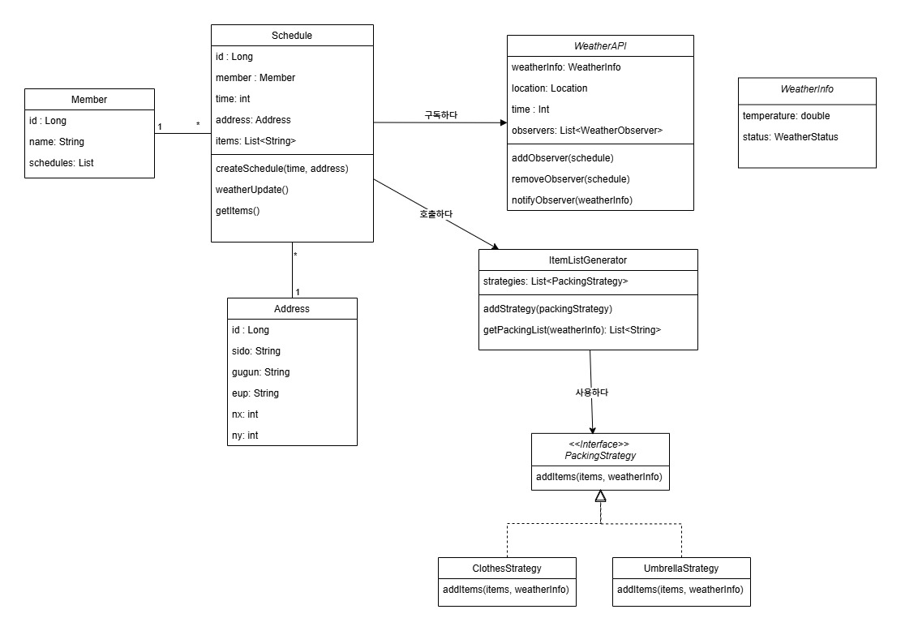
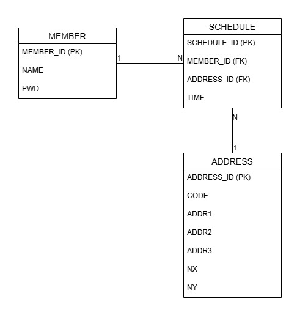

# bring-XXX

사용자가 등록해둔 장소&amp;시간의 날씨 정보에 따라 그 날 챙겨야 할 소지품들을 알려주는 프로그램

&nbsp;

## 설계

- [요구사항 정의서](./doc/요구사항%20정의서.md)

- 클래스 다이어그램

   

- ERD

   

&nbsp;

## 날씨 데이터 출처 

[기상청_단기예보 ((구)_동네예보) 조회서비스](https://www.data.go.kr/iim/api/selectAPIAcountView.do)
