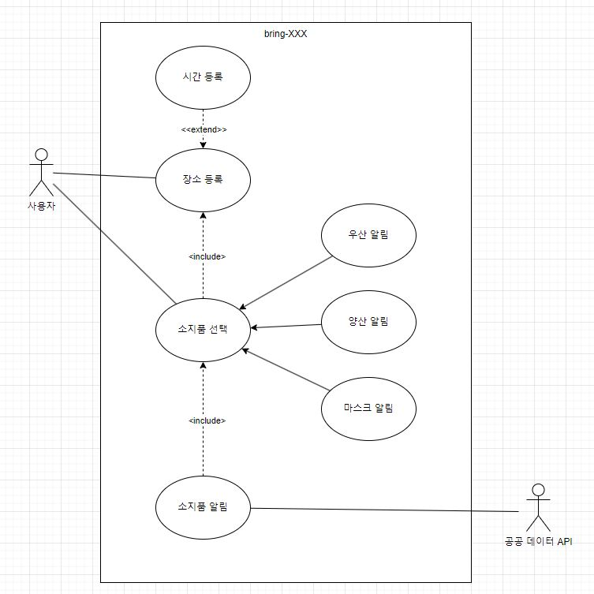

	
<h1 class="page-title">기능 모델링</h1>

<h1 id="3e1760b5-fe46-4714-a057-30a961987fa0" class="">1. 시스템 개요</h1><h3 id="113ed3f5-9e10-4802-ae5b-6f018abebf50" class="">1-1. 시스템 명칭</h3>
bring-XXX

<h3 id="7cbe02d1-9fc1-4e6f-93c3-1fa49584a55e" class="">1-2. 시스템 설명 정의</h3>
매일 사용자의 외출 시간에 챙겨야 하는 물건을 보여주는 웹 어플리케이션이다. 

<h3 id="77d769b2-874b-4bdb-8eb5-764e9fccfd07" class="">1-3. 주요 기능 설명</h3><ul id="8f091536-ffd0-4fbd-b4a4-32f46df26136" class="bulleted-list"><li style="list-style-type:disc">사용자는 외출 시간/장소/물건을 등록할 수 있다.</li></ul><ul id="24c6955e-b54c-4c7c-bcd0-040e3d515c1d" class="bulleted-list"><li style="list-style-type:disc">사용자는 매일 외출 시간에 외출 장소의 기후 상태에 따라 챙겨야 하는 물건을 확인할 수 있다.</li></ul>

<h3 id="fb716825-cbd7-426e-b434-f6e0290536c2" class="">1-4. 용어 정의</h3><ul id="92f44085-0598-449e-8252-21f71a3c2e14" class="bulleted-list"><li style="list-style-type:disc">사용자: bring-XXX를 사용하는 사람.</li></ul><ul id="a241e30a-fa9e-4efb-b291-c7d49b11a1e6" class="bulleted-list"><li style="list-style-type:disc">소지품 알림 장소: 소지품 알림을 받고 싶은 장소. 해당 장소에 소지품에 해당하는 기후가 포함되어 있는지 여부를 체크한다.</li></ul><ul id="48419301-45f9-4e98-a1d8-38de708b82ec" class="bulleted-list"><li style="list-style-type:disc">소지품 알림 시간: 소지품 알림을 받고 싶은 시간. 해당 시간대에 소지품에 해당하는 기후가 포함되어 있는지 여부를 체크한다.</li></ul><ul id="2f479b68-1e7a-4a4d-969e-8c6c01c0f905" class="bulleted-list"><li style="list-style-type:disc">소지품: 챙겨야 할 물건. 우산, 마스크, 양산이 있다.</li></ul>

<h1 id="921a749d-30cb-48c0-bdb7-4cfa287f2dfb" class="">2. 기능 모델링</h1><h3 id="1636dd27-9b0f-485e-9198-dbadf7f9cd01" class="">2-1. 액터 리스트</h3><ul id="cfd483cc-6b36-4b61-87eb-89d36c0f637f" class="bulleted-list"><li style="list-style-type:disc">사용자: 웹을 조작하는 사람</li></ul><ul id="ed5a7343-407e-480b-8906-fd5b520197fc" class="bulleted-list"><li style="list-style-type:disc">공공 데이터 API: 날씨 정보를 제공해주는 시스템</li></ul><ul id="2196ca14-84b5-451a-82ce-ce706249dc69" class="bulleted-list"><li style="list-style-type:disc">데이터베이스: 사용자 정보를 저장해주는 시스템</li></ul>

<h3 id="8bce57f9-dd40-4b80-b733-c73cdf769302" class="">2-2. Use-case Diagram</h3><figure id="98cf337f-8e78-47a5-8cad-2dbe698d4aa3" class="image"></figure><h3 id="d2412bf3-672b-4896-8f77-52602d287d32" class="">2-3. Use-case 설명서</h3><ol type="1" id="51a5db20-e92f-4b62-b5f3-e7e648efe6d8" class="numbered-list" start="1"><li>장소 등록<table id="bf3c0c53-de85-4506-8183-b16ea88809f7" class="simple-table"><tbody><tr id="7cddbc8e-0fa3-4ff4-85cd-4d658b01fddc"><th id="eFCd" class="simple-table-header-color simple-table-header" style="width:202px">Important Level</th><td id="K`I:" class="" style="width:457px">high</td></tr><tr id="f587e13f-786c-4609-be53-1c2ee04134fc"><th id="eFCd" class="simple-table-header-color simple-table-header" style="width:202px">Primary Actor</th><td id="K`I:" class="" style="width:457px">사용자</td></tr><tr id="9cd1355b-27d1-413c-8f88-d7a38a7b64e9"><th id="eFCd" class="simple-table-header-color simple-table-header" style="width:202px">Use Case Type</th><td id="K`I:" class="" style="width:457px">Detail, Essential</td></tr><tr id="4a302e4b-1397-498d-b98b-f3abdf0e34ac"><th id="eFCd" class="simple-table-header-color simple-table-header" style="width:202px">Stakeholders and Interests</th><td id="K`I:" class="" style="width:457px">사용자가 소지품 알림 장소를 등록하고 싶을 때</td></tr><tr id="cf0450ab-e625-44e6-bf11-b0f34b19e49a"><th id="eFCd" class="simple-table-header-color simple-table-header" style="width:202px">Brief Description</th><td id="K`I:" class="" style="width:457px">이 유스케이스는 사용자가 소지품 알림을 받고 싶은 장소를 추가, 삭제하는 행위에 대해 기술한다.</td></tr><tr id="fc1fe63d-2015-488c-abb7-6b6845bc8cfe"><th id="eFCd" class="simple-table-header-color simple-table-header" style="width:202px">Trigger</th><td id="K`I:" class="" style="width:457px">사용자가 ‘알림 설정’ 페이지로 들어왔을 때</td></tr><tr id="a27f00b2-c9cb-4383-a9c1-b8a7eb662aa1"><th id="eFCd" class="simple-table-header-color simple-table-header" style="width:202px">Relationships</th><td id="K`I:" class="" style="width:457px">Association: 사용자 Include:  Extend: 시간 등록 Generalization:  </td></tr><tr id="a0615f16-971f-4e0f-970d-d081c58aa60e"><th id="eFCd" class="simple-table-header-color simple-table-header" style="width:202px">Normal Flow of Events</th><td id="K`I:" class="" style="width:457px">1. 사용자가 ‘알림 설정’ 페이지로 들어간다. 2. 사용자가 ‘장소 추가’ 버튼을 클릭했을 때     S-1. 장소 추가 subflow가 실행된다. 3. 사용자가 등록된 장소를 클릭했을 때     S-2. 장소 삭제 subflow가 실행된다. </td></tr><tr id="24242293-9933-4384-a8fb-add8ab88891a"><th id="eFCd" class="simple-table-header-color simple-table-header" style="width:202px">SubFlows</th><td id="K`I:" class="" style="width:457px">S-1. 장소 추가 subflow     1. 사용자는 원하는 장소를 입력한다.     2. 사용자가 ‘시간’ 버튼을 클릭한 경우, 시스템은 ‘시간 등록’ 유즈케이스를 호출한다. S-2. 장소 삭제 subflow     1. 사용자는 등록된 장소를 선택한다.     2. 시스템은 등록된 장소 옆에 휴지통 아이콘이 나타나게 한다.     3. 사용자가 휴지통 아이콘을 누르면 장소가 삭제된다. </td></tr><tr id="1f6eaf16-ba10-409d-b5ea-13f852119e6e"><th id="eFCd" class="simple-table-header-color simple-table-header" style="width:202px">Alternate/Exceptional Flows</th><td id="K`I:" class="" style="width:457px">S-2, e1. 기존에 등록된 장소가 없을 경우 빈 화면이 나타난다.</td></tr></tbody></table></li></ol><ol type="1" id="1974ff3c-651f-4c5a-96a4-0a260bfa4aa8" class="numbered-list" start="2"><li>시간 등록<table id="51ad7bb7-1e6d-4de2-9617-2a9eecc35f0b" class="simple-table"><tbody><tr id="29fdd070-b5b6-4de0-9cf9-b71720e93e3a"><th id="eFCd" class="simple-table-header-color simple-table-header" style="width:202px">Important Level</th><td id="K`I:" class="" style="width:457px">high</td></tr><tr id="b890669e-984d-49e3-980e-8ea9713c5ec2"><th id="eFCd" class="simple-table-header-color simple-table-header" style="width:202px">Primary Actor</th><td id="K`I:" class="" style="width:457px">사용자</td></tr><tr id="f2ea83a7-b7e1-4865-a67f-bc16988d30c9"><th id="eFCd" class="simple-table-header-color simple-table-header" style="width:202px">Use Case Type</th><td id="K`I:" class="" style="width:457px">Detail, Essential</td></tr><tr id="fcfaf191-77bf-40d8-96c5-95c159ebcb6e"><th id="eFCd" class="simple-table-header-color simple-table-header" style="width:202px">Stakeholders and Interests</th><td id="K`I:" class="" style="width:457px">사용자가 소지품 알림 시간을 등록하고 싶을 때</td></tr><tr id="3afff031-2889-485d-8e89-202401504f7e"><th id="eFCd" class="simple-table-header-color simple-table-header" style="width:202px">Brief Description</th><td id="K`I:" class="" style="width:457px">이 유스케이스는 사용자가 소지품 알림을 받고 싶은 시간을 추가, 삭제하는 행위에 대해 기술한다.</td></tr><tr id="99322be9-e138-4a5f-9061-179adf780516"><th id="eFCd" class="simple-table-header-color simple-table-header" style="width:202px">Trigger</th><td id="K`I:" class="" style="width:457px">사용자가 ‘장소 등록’ 유즈케이스에서 ‘시간’ 버튼을 눌렀을 때</td></tr><tr id="a5edf677-d698-43d4-87f7-c8eb3df97f30"><th id="eFCd" class="simple-table-header-color simple-table-header" style="width:202px">Relationships</th><td id="K`I:" class="" style="width:457px">Association: 사용자 Include: 장소 등록 Extend:  Generalization:  </td></tr><tr id="c3e9e6df-fad6-4509-b4ed-feb540400f13"><th id="eFCd" class="simple-table-header-color simple-table-header" style="width:202px">Normal Flow of Events</th><td id="K`I:" class="" style="width:457px">1. 시스템은 사용자에게 일주일 시간표를 보여준다. 2. 사용자는 원하는 시간대를 드래그한다. 3. 기존에 선택된 시간대를 다시 클릭하면 해당 시간대는 삭제된다. 4. 사용자가 선택한 시간대를 시스템에 저장한다. </td></tr><tr id="18ac91e8-ff60-411f-b969-adedcee6d621"><th id="eFCd" class="simple-table-header-color simple-table-header" style="width:202px">SubFlows</th><td id="K`I:" class="" style="width:457px"></td></tr><tr id="9b16389d-6acc-4100-8ab7-addbe89e0174"><th id="eFCd" class="simple-table-header-color simple-table-header" style="width:202px">Alternate/Exceptional Flows</th><td id="K`I:" class="" style="width:457px">사용자가 시간대를 등록하지 않았을 때, 저장 값은 NULL로 지정한다.</td></tr></tbody></table></li></ol><ol type="1" id="d2550486-b6f1-4866-89e7-59d9865da15a" class="numbered-list" start="3"><li>소지품 등록<table id="6df381ff-1075-4cfd-b3c1-6eadcce32a3c" class="simple-table"><tbody><tr id="362a309d-615d-48fa-9f57-083564e9e0cb"><th id="eFCd" class="simple-table-header-color simple-table-header" style="width:202px">Important Level</th><td id="K`I:" class="" style="width:457px">high</td></tr><tr id="595d58b1-513a-4b3d-b36f-38c44cfc9287"><th id="eFCd" class="simple-table-header-color simple-table-header" style="width:202px">Primary Actor</th><td id="K`I:" class="" style="width:457px">사용자</td></tr><tr id="5ad7df99-6996-40ef-bd0c-f8bf92752b77"><th id="eFCd" class="simple-table-header-color simple-table-header" style="width:202px">Use Case Type</th><td id="K`I:" class="" style="width:457px">Detail, Essential</td></tr><tr id="7a6de48a-7819-4f68-9776-2fbcd69ea17a"><th id="eFCd" class="simple-table-header-color simple-table-header" style="width:202px">Stakeholders and Interests</th><td id="K`I:" class="" style="width:457px">사용자가 소지품을 등록하고 싶을 때</td></tr><tr id="827062cf-9f91-42bf-9af6-006b3f61a5f8"><th id="eFCd" class="simple-table-header-color simple-table-header" style="width:202px">Brief Description</th><td id="K`I:" class="" style="width:457px">이 유스케이스는 사용자가 알림을 받고 싶은 소지품을 등록할 때 사용한다.</td></tr><tr id="70ea8997-b37a-445a-bb2c-99728131802e"><th id="eFCd" class="simple-table-header-color simple-table-header" style="width:202px">Trigger</th><td id="K`I:" class="" style="width:457px">사용자가 ‘알림 설정’ 페이지로 들어왔을 때</td></tr><tr id="c9144b4e-a84b-49ab-8b3f-d8d7bb593880"><th id="eFCd" class="simple-table-header-color simple-table-header" style="width:202px">Relationships</th><td id="K`I:" class="" style="width:457px">Association: 사용자 Include:  Extend:  Generalization: 우산 알림, 양산 알림, 마스크 알림 </td></tr><tr id="4bc95906-3170-4e07-8ac2-590bb561a8c3"><th id="eFCd" class="simple-table-header-color simple-table-header" style="width:202px">Normal Flow of Events</th><td id="K`I:" class="" style="width:457px">1. 시스템은 ‘소지품’ 란에 우산 알림, 양산 알림, 마스크 알림을 보여준다. 2. 사용자는 알림을 받고 싶은 소지품을 선택한다. 3. 사용자의 소지품 정보를 시스템에 저장한다. </td></tr><tr id="50a9a24d-bcf9-479c-812f-dcbaf35e18db"><th id="eFCd" class="simple-table-header-color simple-table-header" style="width:202px">SubFlows</th><td id="K`I:" class="" style="width:457px"></td></tr><tr id="87069e8f-b3b1-4b4d-9993-4911faab1206"><th id="eFCd" class="simple-table-header-color simple-table-header" style="width:202px">Alternate/Exceptional Flows</th><td id="K`I:" class="" style="width:457px"></td></tr></tbody></table></li></ol><ol type="1" id="8027e1f1-e237-4b10-b228-7c91bf12bca5" class="numbered-list" start="4"><li>소지품 알림받기<table id="46fb04b6-f48b-4b2d-b497-fe718844eaf8" class="simple-table"><tbody><tr id="e66ebafb-563b-489a-922c-a8f5f6c5fc62"><th id="eFCd" class="simple-table-header-color simple-table-header" style="width:202px">Important Level</th><td id="K`I:" class="" style="width:457px">high</td></tr><tr id="ade73cae-a046-4aae-8a2b-a3971393888d"><th id="eFCd" class="simple-table-header-color simple-table-header" style="width:202px">Primary Actor</th><td id="K`I:" class="" style="width:457px">사용자</td></tr><tr id="3fccbad8-f3b2-4e81-aaa6-bb995cbc2c7c"><th id="eFCd" class="simple-table-header-color simple-table-header" style="width:202px">Use Case Type</th><td id="K`I:" class="" style="width:457px">Detail, Essential</td></tr><tr id="47c5390a-c9ad-41dc-8caa-034768eab672"><th id="eFCd" class="simple-table-header-color simple-table-header" style="width:202px">Stakeholders and Interests</th><td id="K`I:" class="" style="width:457px">사용자가 당일 챙겨야 하는 소지품을 확인하고 싶을 때</td></tr><tr id="b60ae28c-b75f-4f5f-a3df-c4cac6cf8e81"><th id="eFCd" class="simple-table-header-color simple-table-header" style="width:202px">Brief Description</th><td id="K`I:" class="" style="width:457px">이 유스케이스는 사용자가 당일 챙겨야 하는 소지품을 확인하고 싶을 때 사용한다.</td></tr><tr id="bd23898c-fdd6-4812-bfce-03533315d1b7"><th id="eFCd" class="simple-table-header-color simple-table-header" style="width:202px">Trigger</th><td id="K`I:" class="" style="width:457px">사용자가 시스템 메인 페이지에 들어왔을 때</td></tr><tr id="cbfee363-0571-4760-b77b-e7c4314736e5"><th id="eFCd" class="simple-table-header-color simple-table-header" style="width:202px">Relationships</th><td id="K`I:" class="" style="width:457px">Association: 공공데이터 API Include: 소지품 선택 Extend:  Generalization:  </td></tr><tr id="ccdf6533-9adb-4d7a-8765-4c967d69ceff"><th id="eFCd" class="simple-table-header-color simple-table-header" style="width:202px">Normal Flow of Events</th><td id="K`I:" class="" style="width:457px">1. 사용자는 메인 페이지에 들어온다. 2. 시스템은 사용자가 당일 챙겨야 하는 소지품 리스트를 보여준다. </td></tr><tr id="1717a17d-1988-40b1-a8ed-923d37b84720"><th id="eFCd" class="simple-table-header-color simple-table-header" style="width:202px">SubFlows</th><td id="K`I:" class="" style="width:457px"></td></tr><tr id="43df07cf-2de0-4c24-a9ba-b64639c9eb11"><th id="eFCd" class="simple-table-header-color simple-table-header" style="width:202px">Alternate/Exceptional Flows</th><td id="K`I:" class="" style="width:457px">1,a1. 사용자가 기존에 등록한 정보가 없을 때에는 시스템 가이드 페이지를 보여준다.</td></tr></tbody></table></li></ol>

</article></body></html>